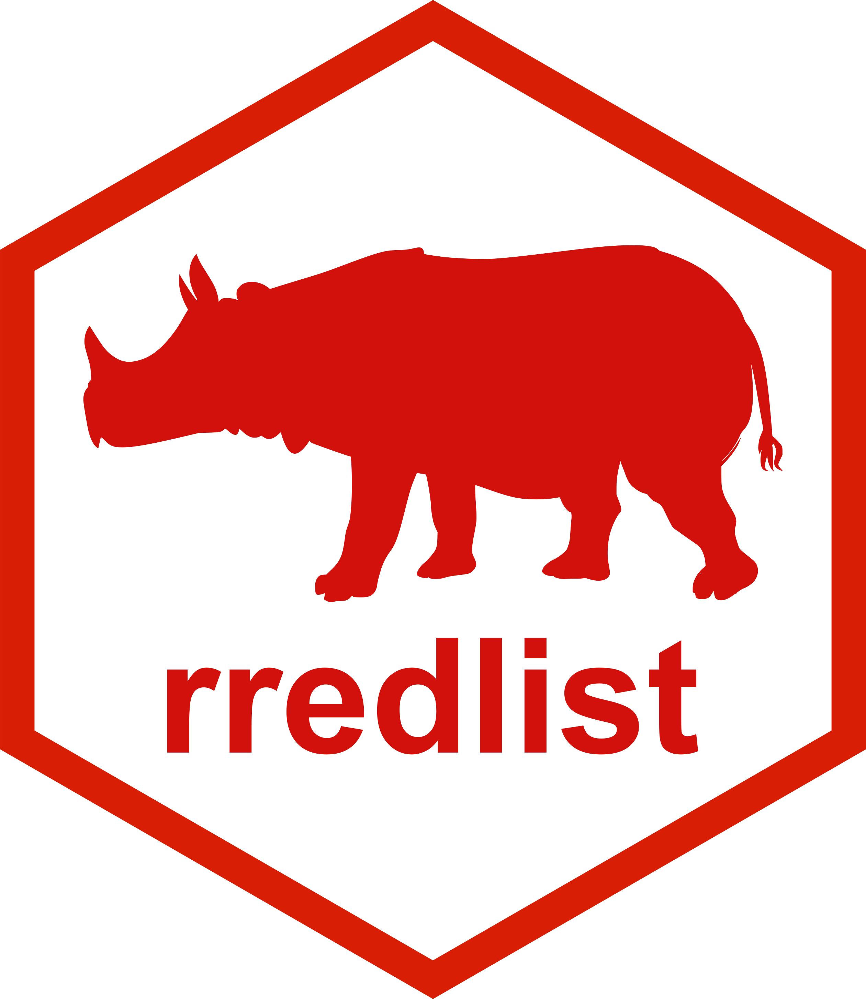

# rredlist 

```{r echo=FALSE}
library("knitr")
library("rredlist")
hook_output <- knitr::knit_hooks$get("output")
knitr::knit_hooks$set(output = function(x, options) {
   lines <- options$output.lines
   if (is.null(lines)) {
     return(hook_output(x, options))  # pass to default hook
   }
   x <- unlist(strsplit(x, "\n"))
   more <- "..."
   if (length(lines)==1) {        # first n lines
     if (length(x) > lines) {
       # truncate the output, but add ....
       x <- c(head(x, lines), more)
     }
   } else {
     x <- c(if (abs(lines[1])>1) more else NULL,
            x[lines],
            if (length(x)>lines[abs(length(lines))]) more else NULL
           )
   }
   # paste these lines together
   x <- paste(c(x, ""), collapse = "\n")
   hook_output(x, options)
 })

knitr::opts_chunk$set(
  warning = FALSE,
  message = FALSE,
  collapse = TRUE,
  comment = "#>"
)
```

[](https://github.com/ropensci/software-review/issues/663)
[](https://www.repostatus.org/#active)
[](https://cran.r-project.org/package=rredlist)
[](https://github.com/ropensci/rredlist/actions/workflows/R-check.yml)
[](https://app.codecov.io/gh/ropensci/rredlist)
[](https://github.com/r-hub/cranlogs.app)

`rredlist` is an R client for the IUCN Red List API (https://api.iucnredlist.org). The [IUCN Red List](https://www.iucnredlist.org/) is the world’s most comprehensive information source on the global extinction risk status of animal, fungus, and plant species. This package provides access via R to the various data contained within this database which span range details, population size, habitat and ecology, use and/or trade, threats, and conservation actions. The functions within the package cover all endpoints of the IUCN Red List web API, which are documented [here](https://api.iucnredlist.org/api-docs/index.html).

## Installation

CRAN

```{r eval=FALSE}
install.packages("rredlist")
```

Development version

```{r eval=FALSE}
remotes::install_github("ropensci/rredlist")
# OR
install.packages("rredlist", repos = "https://ropensci.r-universe.dev/")
```

## Authentication

Use of this package requires an IUCN API key which can be acquired at https://api.iucnredlist.org/users/sign_up. There is a helper function to help you get the key and store it properly:

```{r eval=FALSE}
rredlist::rl_use_iucn()
```

**Keep this key private.** You can pass the key in to each function via the key parameter, but it’s better to store the key either as an environment variable (`IUCN_REDLIST_KEY`) or an R option (`iucn_redlist_key`) - we recommend using the former option. Note that there is not a default API key that is used as a fallback, and the package will not function without providing/storing your own API key.

## Example usage

### Loading the package
```{r}
library("rredlist")
```

### Search for assessments for a particular species
```{r output.lines=1:10}
rl_species("Gorilla", "gorilla")$assessments
```

### Search for assessments that recommend particular conservation actions

#### Get a list of all conservation actions
```{r output.lines=1:10}
rl_actions()
```

#### Return assessments with a particular conservation action
```{r output.lines=1:10}
rl_actions("2_2", all = FALSE)$assessments
```

## Logo


The `rredlist` logo showcases a silhouette of a [Javan rhinoceros](https://www.iucnredlist.org/species/19495/18493900) (_Rhinoceros sondaicus_), one of the most endangered mammal species on the planet. The species has suffered extreme population decline due to habitat loss and poaching, with only ~75 individuals alive in the wild today, all in Ujung Kulon National Park, a [UNESCO World Heritage Site](https://whc.unesco.org/en/list/608) in Java, Indonesia. Despite recent conservation efforts, [poaching continues](https://www.savetherhino.org/asia/indonesia/poaching-gangs-claim-to-have-killed-one-third-of-the-remaining-javan-rhino-population/); further, the small population is extremely susceptible to inbreeding, disease, and further habitat loss due to the rampant spreading of local palm trees. You can read more about the Javan rhino on the [IUCN Red List](https://www.iucnredlist.org/species/19495/18493900), [World Wildlife Fund](https://www.worldwildlife.org/species/javan-rhino), and [International Rhino Foundation](https://rhinos.org/about-rhinos/rhino-species/javan-rhino/).

This work, "rredlist logo", is adapted from ["Javan rhino silhouette"](https://creazilla.com/media/silhouette/64313/javan-rhino) by [Creazilla](https://creazilla.com/), used under [CC BY 4.0](https://creativecommons.org/licenses/by/4.0/). "rredlist logo" is licensed under [CC BY 4.0](https://creativecommons.org/licenses/by/4.0/) by William Gearty.

## Meta

* Please [report any issues or bugs](https://github.com/ropensci/rredlist/issues).
* License: MIT
* Get citation information for `rredlist` in R doing `citation(package = 'rredlist')`
* Please note that this package is released with a [Contributor Code of Conduct](https://ropensci.org/code-of-conduct/). By contributing to this project, you agree to abide by its terms.

[](https://ropensci.org)

## Contributors


<!-- ALL-CONTRIBUTORS-LIST:START - Do not remove or modify this section -->
<!-- prettier-ignore-start -->
<!-- markdownlint-disable -->

All contributions to this project are gratefully acknowledged using the [`allcontributors` package](https://github.com/ropensci/allcontributors) following the [allcontributors](https://github.com/all-contributors/all-contributors) specification. Contributions of any kind are welcome!

### Code

<table>

<tr>
<td align="center">
<a href="https://github.com/sckott">

</a><br>
<a href="https://github.com/ropensci/rredlist/commits?author=sckott">sckott</a>
</td>
<td align="center">
<a href="https://github.com/willgearty">

</a><br>
<a href="https://github.com/ropensci/rredlist/commits?author=willgearty">willgearty</a>
</td>
<td align="center">
<a href="https://github.com/maelle">

</a><br>
<a href="https://github.com/ropensci/rredlist/commits?author=maelle">maelle</a>
</td>
<td align="center">
<a href="https://github.com/jeffreyhanson">

</a><br>
<a href="https://github.com/ropensci/rredlist/commits?author=jeffreyhanson">jeffreyhanson</a>
</td>
<td align="center">
<a href="https://github.com/jeroen">

</a><br>
<a href="https://github.com/ropensci/rredlist/commits?author=jeroen">jeroen</a>
</td>
<td align="center">
<a href="https://github.com/KevCaz">

</a><br>
<a href="https://github.com/ropensci/rredlist/commits?author=KevCaz">KevCaz</a>
</td>
</tr>

</table>


### Issue Authors

<table>

<tr>
<td align="center">
<a href="https://github.com/stevenpbachman">

</a><br>
<a href="https://github.com/ropensci/rredlist/issues?q=is%3Aissue+author%3Astevenpbachman">stevenpbachman</a>
</td>
<td align="center">
<a href="https://github.com/FVFaleiro">

</a><br>
<a href="https://github.com/ropensci/rredlist/issues?q=is%3Aissue+author%3AFVFaleiro">FVFaleiro</a>
</td>
<td align="center">
<a href="https://github.com/git-og">

</a><br>
<a href="https://github.com/ropensci/rredlist/issues?q=is%3Aissue+author%3Agit-og">git-og</a>
</td>
<td align="center">
<a href="https://github.com/arw36">

</a><br>
<a href="https://github.com/ropensci/rredlist/issues?q=is%3Aissue+author%3Aarw36">arw36</a>
</td>
<td align="center">
<a href="https://github.com/electricquad">

</a><br>
<a href="https://github.com/ropensci/rredlist/issues?q=is%3Aissue+author%3Aelectricquad">electricquad</a>
</td>
<td align="center">
<a href="https://github.com/bgerstner90">

</a><br>
<a href="https://github.com/ropensci/rredlist/issues?q=is%3Aissue+author%3Abgerstner90">bgerstner90</a>
</td>
<td align="center">
<a href="https://github.com/lime-n">

</a><br>
<a href="https://github.com/ropensci/rredlist/issues?q=is%3Aissue+author%3Alime-n">lime-n</a>
</td>
</tr>


<tr>
<td align="center">
<a href="https://github.com/marcelxelo">

</a><br>
<a href="https://github.com/ropensci/rredlist/issues?q=is%3Aissue+author%3Amarcelxelo">marcelxelo</a>
</td>
<td align="center">
<a href="https://github.com/cpavloud">

</a><br>
<a href="https://github.com/ropensci/rredlist/issues?q=is%3Aissue+author%3Acpavloud">cpavloud</a>
</td>
<td align="center">
<a href="https://github.com/Gopal-Murali">

</a><br>
<a href="https://github.com/ropensci/rredlist/issues?q=is%3Aissue+author%3AGopal-Murali">Gopal-Murali</a>
</td>
<td align="center">
<a href="https://github.com/DanielIAvila">

</a><br>
<a href="https://github.com/ropensci/rredlist/issues?q=is%3Aissue+author%3ADanielIAvila">DanielIAvila</a>
</td>
<td align="center">
<a href="https://github.com/michitobler">

</a><br>
<a href="https://github.com/ropensci/rredlist/issues?q=is%3Aissue+author%3Amichitobler">michitobler</a>
</td>
<td align="center">
<a href="https://github.com/martijnvandepol">

</a><br>
<a href="https://github.com/ropensci/rredlist/issues?q=is%3Aissue+author%3Amartijnvandepol">martijnvandepol</a>
</td>
<td align="center">
<a href="https://github.com/XuWeiEvo">

</a><br>
<a href="https://github.com/ropensci/rredlist/issues?q=is%3Aissue+author%3AXuWeiEvo">XuWeiEvo</a>
</td>
</tr>


<tr>
<td align="center">
<a href="https://github.com/makosiaaa">

</a><br>
<a href="https://github.com/ropensci/rredlist/issues?q=is%3Aissue+author%3Amakosiaaa">makosiaaa</a>
</td>
<td align="center">
<a href="https://github.com/wk-ai">

</a><br>
<a href="https://github.com/ropensci/rredlist/issues?q=is%3Aissue+author%3Awk-ai">wk-ai</a>
</td>
<td align="center">
<a href="https://github.com/Lisa-Tedeschi">

</a><br>
<a href="https://github.com/ropensci/rredlist/issues?q=is%3Aissue+author%3ALisa-Tedeschi">Lisa-Tedeschi</a>
</td>
<td align="center">
<a href="https://github.com/oldenfish">

</a><br>
<a href="https://github.com/ropensci/rredlist/issues?q=is%3Aissue+author%3Aoldenfish">oldenfish</a>
</td>
<td align="center">
<a href="https://github.com/laetitiatremblay">

</a><br>
<a href="https://github.com/ropensci/rredlist/issues?q=is%3Aissue+author%3Alaetitiatremblay">laetitiatremblay</a>
</td>
</tr>

</table>


### Issue Contributors

<table>

<tr>
<td align="center">
<a href="https://github.com/olliewearn">

</a><br>
<a href="https://github.com/ropensci/rredlist/issues?q=is%3Aissue+commenter%3Aolliewearn">olliewearn</a>
</td>
<td align="center">
<a href="https://github.com/matthewlewis896">

</a><br>
<a href="https://github.com/ropensci/rredlist/issues?q=is%3Aissue+commenter%3Amatthewlewis896">matthewlewis896</a>
</td>
<td align="center">
<a href="https://github.com/mairindeith">

</a><br>
<a href="https://github.com/ropensci/rredlist/issues?q=is%3Aissue+commenter%3Amairindeith">mairindeith</a>
</td>
<td align="center">
<a href="https://github.com/MirzaCengic">

</a><br>
<a href="https://github.com/ropensci/rredlist/issues?q=is%3Aissue+commenter%3AMirzaCengic">MirzaCengic</a>
</td>
<td align="center">
<a href="https://github.com/rdornas">

</a><br>
<a href="https://github.com/ropensci/rredlist/issues?q=is%3Aissue+commenter%3Ardornas">rdornas</a>
</td>
<td align="center">
<a href="https://github.com/awpark">

</a><br>
<a href="https://github.com/ropensci/rredlist/issues?q=is%3Aissue+commenter%3Aawpark">awpark</a>
</td>
<td align="center">
<a href="https://github.com/ingomiller">

</a><br>
<a href="https://github.com/ropensci/rredlist/issues?q=is%3Aissue+commenter%3Aingomiller">ingomiller</a>
</td>
</tr>


<tr>
<td align="center">
<a href="https://github.com/yabellini">

</a><br>
<a href="https://github.com/ropensci/rredlist/issues?q=is%3Aissue+commenter%3Ayabellini">yabellini</a>
</td>
<td align="center">
<a href="https://github.com/benscarlson">

</a><br>
<a href="https://github.com/ropensci/rredlist/issues?q=is%3Aissue+commenter%3Abenscarlson">benscarlson</a>
</td>
<td align="center">
<a href="https://github.com/mcauchoix">

</a><br>
<a href="https://github.com/ropensci/rredlist/issues?q=is%3Aissue+commenter%3Amcauchoix">mcauchoix</a>
</td>
<td align="center">
<a href="https://github.com/magpiedin">

</a><br>
<a href="https://github.com/ropensci/rredlist/issues?q=is%3Aissue+commenter%3Amagpiedin">magpiedin</a>
</td>
<td align="center">
<a href="https://github.com/klausriede">

</a><br>
<a href="https://github.com/ropensci/rredlist/issues?q=is%3Aissue+commenter%3Aklausriede">klausriede</a>
</td>
<td align="center">
<a href="https://github.com/simon-tarr">

</a><br>
<a href="https://github.com/ropensci/rredlist/issues?q=is%3Aissue+commenter%3Asimon-tarr">simon-tarr</a>
</td>
<td align="center">
<a href="https://github.com/ToleranceTrading">

</a><br>
<a href="https://github.com/ropensci/rredlist/issues?q=is%3Aissue+commenter%3AToleranceTrading">ToleranceTrading</a>
</td>
</tr>


<tr>
<td align="center">
<a href="https://github.com/omerome83">

</a><br>
<a href="https://github.com/ropensci/rredlist/issues?q=is%3Aissue+commenter%3Aomerome83">omerome83</a>
</td>
<td align="center">
<a href="https://github.com/Crastoman">

</a><br>
<a href="https://github.com/ropensci/rredlist/issues?q=is%3Aissue+commenter%3ACrastoman">Crastoman</a>
</td>
<td align="center">
<a href="https://github.com/karolazvdo">

</a><br>
<a href="https://github.com/ropensci/rredlist/issues?q=is%3Aissue+commenter%3Akarolazvdo">karolazvdo</a>
</td>
<td align="center">
<a href="https://github.com/Andresmrv3">

</a><br>
<a href="https://github.com/ropensci/rredlist/issues?q=is%3Aissue+commenter%3AAndresmrv3">Andresmrv3</a>
</td>
<td align="center">
<a href="https://github.com/jzhongwen">

</a><br>
<a href="https://github.com/ropensci/rredlist/issues?q=is%3Aissue+commenter%3Ajzhongwen">jzhongwen</a>
</td>
<td align="center">
<a href="https://github.com/malmagrok">

</a><br>
<a href="https://github.com/ropensci/rredlist/issues?q=is%3Aissue+commenter%3Amalmagrok">malmagrok</a>
</td>
<td align="center">
<a href="https://github.com/nicholasZ16">

</a><br>
<a href="https://github.com/ropensci/rredlist/issues?q=is%3Aissue+commenter%3AnicholasZ16">nicholasZ16</a>
</td>
</tr>


<tr>
<td align="center">
<a href="https://github.com/dcuadrac">

</a><br>
<a href="https://github.com/ropensci/rredlist/issues?q=is%3Aissue+commenter%3Adcuadrac">dcuadrac</a>
</td>
</tr>

</table>

<!-- markdownlint-enable -->
<!-- prettier-ignore-end -->
<!-- ALL-CONTRIBUTORS-LIST:END -->

