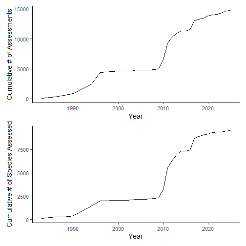
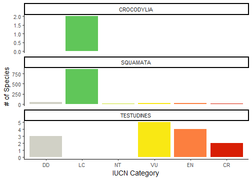
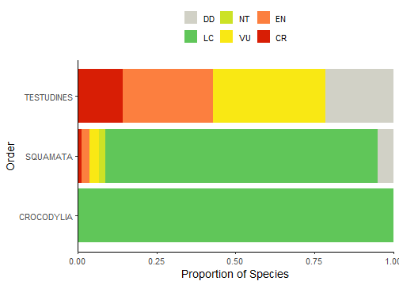
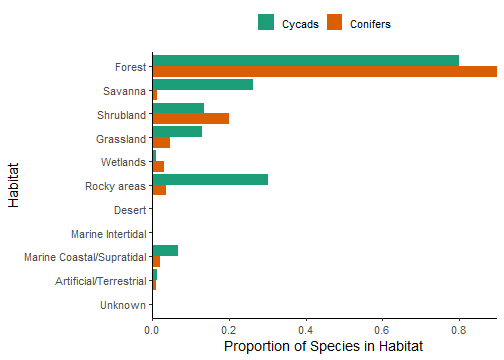

<div style="text-align: justify">

## Introduction

Once you have `rredlist` [set up](rredlist.html), it's very likely you'll want to use it for some sort of research workflow. This vignette gives examples of the kinds of data that users may be interested in downloading from the IUCN API, and how they might then use that data within a partial research workflow. I've given three worked examples, but because the possibilities are pretty endless, I've also cited some recent published works at the bottom of the vignette to cover a wider variety of use cases.

Before we get started, we'll just load some packages that we'll need. We'll use `{dplyr}` for handling and cleaning our data, and we'll use `{ggplot2}` and `{patchwork}` for visualizing our data.


``` r
library(rredlist)
library(dplyr)
library(ggplot2)
library(patchwork)
```

## How have mollusc assessments increased through time?

For our first research workflow, we are interested in the assessment of molluscs through time. Specifically, we are interested in how many cumulative assessments have been completed each year, and how many cumulative species have then been assessed each year. First, we'll need to download an assessment summary for Mollusca. Note that while I've used `quiet = TRUE` here for the purposes of the vignette, you would likely want to skip that to get a lovely progress bar that keeps you apprised of the download's progress since there are quite a few pages of assessments to download.


``` r
moll_assessments <- rl_phylum(phylum = "Mollusca", quiet = TRUE)
```

Now that we have our assessment summary, we can summarize the data by calculating the cumulative numbers of assessments through time. This is a fairly basic `{dplyr}` pipeline that counts the number of assessments for each year, then orders those counts from oldest to most recent, then calculates the cumulative sum of the counts.


``` r
moll_counts <- moll_assessments$assessments %>%
  group_by(year_published) %>%
  summarize(assess_cnt = n()) %>%
  ungroup() %>%
  mutate(year_published = as.numeric(year_published)) %>%
  arrange(year_published) %>%
  mutate(assess_cum = cumsum(assess_cnt))

```

Now that we have our cumulative sums, we can make a simple plot. We'll save it for later to combine with our second plot.


``` r
gg1 <- ggplot(moll_counts) +
  geom_line(aes(x = year_published, y = assess_cum)) +
  labs(x = "Year", y = "Cumulative # of Assessments") +
  theme_classic(base_size = 14)
```

Now let's see how many cumulative _species_ are assessed by year. In order to do this, we'll first need to filter to only the first assessment for each species using `arrange()` and `slice()`. Then we can calculate the cumulative sum as we did for the assessments above.


``` r
moll_sp_counts <- moll_assessments$assessments %>%
  mutate(year_published = as.numeric(year_published)) %>%
  group_by(sis_taxon_id) %>%
  arrange(year_published) %>%
  slice(1) %>%
  ungroup() %>%
  group_by(year_published) %>%
  summarize(sp_cnt = n()) %>%
  ungroup() %>%
  mutate(year_published = as.numeric(year_published)) %>%
  arrange(year_published) %>%
  mutate(sp_cum = cumsum(sp_cnt))

```

Now that we have our species cumulative sums, we can visualize that and combine the two plots together.


``` r
gg2 <- ggplot(moll_sp_counts) +
  geom_line(aes(x = year_published, y = sp_cum)) +
  labs(x = "Year", y = "Cumulative # of Species Assessed") +
  theme_classic(base_size = 14)

gg1 / gg2
```

<div class="figure" style="text-align: center">

<p class="caption">plot of chunk unnamed-chunk-7</p>
</div>

Et voila! Now we have a fairly straightforward visualization of mollusc IUCN assessment through time, indicating that there were some booms and lulls over this interval. We also see one or two instances where the majority of the assessments were of previously assessed species instead of new species.

## What is the conservation status of Australian reptiles?

That first workflow only used an assessment summary, but there is so much more data available via the IUCN API if we retrieve entire assessments. Of course, these assessments include the threat status of each species, so let's start with that. In this case, we'll assess the overall threat status of differences orders of Australian reptiles.

First, we'll need to figure out which Australian reptiles have been assessed. Unfortunately, we can't do this in a single query, so we'll need to get the intersection of all reptiles that have been assessed and all Australian species that have been assessed. Let's get the Australian species assessment summary first. Hmm...what's the code for Australia, again? I can't remember, so let's look it up using the default behavior of `rl_countries()` which returns all country codes:


``` r
rl_countries()
#> $countries
#>                                               en code
#> 1                                        Andorra   AD
#> 2                           United Arab Emirates   AE
#> 3                                    Afghanistan   AF
#> 4                            Antigua and Barbuda   AG
#> 5                                       Anguilla   AI
#> 6                                        Albania   AL
#> 7                                        Armenia   AM
#> 8                                         Angola   AO
#> 9                                     Antarctica   AQ
#> 10                                     Argentina   AR
#> 11                                American Samoa   AS
#> 12                                       Austria   AT
#> 13                                     Australia   AU
#> 14                                         Aruba   AW
#> 15                                 Åland Islands   AX
#> 16                                    Azerbaijan   AZ
#> 17                        Bosnia and Herzegovina   BA
#> 18                                      Barbados   BB
...
```

Ah, "AU", of course! Now we can get an assessment summary for all species that occur in Australia. As opposed to the first use case above, we only care about which species have been assessed, so we'll only retrieve the latest assessments using `latest = TRUE`.


``` r
au_assessments <- rl_countries(code = "AU", quiet = TRUE, latest = TRUE)
names(au_assessments)
#> [1] "country"     "assessments" "filters"
```

You'll notice that the returned assessment actually contains more than just the assessment, it includes information about the query we made ("metadata", if you will). Let's check that it matches what we meant to search:


``` r
au_assessments$country
#> $description
#> $description$en
#> [1] "Australia"
#> 
#> 
#> $code
#> [1] "AU"
au_assessments$filters
#> $latest
#> [1] "TRUE"
```

Yep, that looks good! Now let's inspect the format of the assessment summary:


``` r
names(au_assessments$assessments)
#>  [1] "year_published"               "latest"                       "possibly_extinct"             "possibly_extinct_in_the_wild"
#>  [5] "sis_taxon_id"                 "url"                          "taxon_scientific_name"        "red_list_category_code"      
#>  [9] "assessment_id"                "code"                         "code_type"                    "scopes"
head(au_assessments$assessments)
#>   year_published latest possibly_extinct possibly_extinct_in_the_wild sis_taxon_id                                               url
#> 1           2020   TRUE            FALSE                        FALSE        10030  https://www.iucnredlist.org/species/10030/495630
#> 2           2014   TRUE            FALSE                        FALSE        11150  https://www.iucnredlist.org/species/11150/500780
#> 3           2019   TRUE            FALSE                        FALSE        11200  https://www.iucnredlist.org/species/11200/500969
#> 4           2013   TRUE            FALSE                        FALSE       137084 https://www.iucnredlist.org/species/137084/519692
#> 5           2013   TRUE            FALSE                        FALSE       137097 https://www.iucnredlist.org/species/137097/519904
#> 6           2013   TRUE            FALSE                        FALSE       137119 https://www.iucnredlist.org/species/137119/520192
#>   taxon_scientific_name red_list_category_code assessment_id code code_type    scopes
#> 1     Hexanchus griseus                     NT        495630   AU   country Global, 1
#> 2  Lagocephalus gloveri                     DD        500780   AU   country Global, 1
#> 3           Lamna nasus                     VU        500969   AU   country Global, 1
#> 4     Onthophagus manya                     LC        519692   AU   country Global, 1
#> 5   Coptodactyla lesnei                     LC        519904   AU   country Global, 1
#> 6  Onthophagus lamgalio                     DD        520192   AU   country Global, 1
```

We could go ahead and download the full assessments for all Australian species now, but downloading full assessments is the slowest part of the workflow, so let's get an assessment summary for reptiles first, then only download full assessments for Australian reptiles.


``` r
reptilia_assessments <- rl_class(class = "Reptilia", latest = TRUE, quiet = TRUE)
```

OK, now we've got our assessment summaries for Australian species and for reptiles. We can take those two lists of assessments and find the intersection of them to get the list of assessment IDs for Australian reptiles.


``` r
assessment_ids <- intersect(au_assessments$assessments$assessment_id,
                            reptilia_assessments$assessments$assessment_id)
```

Now that we have this list of IDs, we can download the full assessment information. Before we download full assessments for all of these IDs, let's first take a look at what that looks like for the first assessment. We do that using `rl_assessment()`.


``` r
assessment <- rl_assessment(assessment_ids[1])
names(assessment)
#>  [1] "assessment_date"              "year_published"               "latest"                       "possibly_extinct"            
#>  [5] "possibly_extinct_in_the_wild" "sis_taxon_id"                 "criteria"                     "url"                         
#>  [9] "citation"                     "assessment_id"                "assessment_points"            "assessment_ranges"           
#> [13] "taxon"                        "population_trend"             "red_list_category"            "supplementary_info"          
#> [17] "documentation"                "biogeographical_realms"       "conservation_actions"         "faos"                        
#> [21] "habitats"                     "locations"                    "researches"                   "use_and_trade"               
#> [25] "threats"                      "credits"                      "errata"                       "references"                  
#> [29] "growth_forms"                 "lmes"                         "scopes"                       "stresses"                    
#> [33] "systems"
```

Now you can see why downloading this information will take a while; that's a lot of data! The information available from the IUCN API spans ecology, threats, references, and more!

Now we'll go ahead and download the full records for all of our assessments. Note that performing this many large queries over a short period of time may result in getting timed out by the API. If you do get timed out, `rredlist` will automatically retry the query after a short wait time. By default, if you get timed out more than 3 times for the same query, the query will be stopped and throw an error, forcing you to try the entire download again. You can customize the settings related to these retries, including the wait time and the number of retries. Since this is a pretty large download that we don't want to have to redo, we could increase the number of retries to 10 (from the default of 3), like so:


``` r
assessment_list <- lapply(assessment_ids, rl_assessment, times = 10)
```

Alternatively, if we know we might get timed out because of the download size, we could impose our own wait time between each query to proactively prevent timeouts. IUCN recommends a wait time of 0.5 seconds between queries to avoid timeouts. We can use `Sys.sleep()` to impose such a wait before each query.


``` r
assessment_list <- lapply(assessment_ids,
                          function(x) {
                            Sys.sleep(0.5)
                            rl_assessment(x)
                          }
                          )
```

However, instead of worrying about all of this, we can also use the `rl_assessment_list()` helper function that is included with `rredlist`. This function will retrieve multiple assessments for you while also making sure to wait for a given amount of time (0.5 seconds, by default, as recommended by IUCN) between queries.


``` r
assessment_list <- rl_assessment_list(assessment_ids)
```

OK, now, after a bit of a wait, we have our full assessment records! Each item of this list is a single assessment record. And each assessment record is also a list, with each element representing a different kind of data in the record (e.g., habitats, taxonomy). For this workflow, we only really care about the taxonomic and threat category data, so let's extract those elements from each list item using `rl_assessment_extract()`. Note that the `flatten = TRUE` option for `rl_assessment_extract()` requires the `dplyr`, `tibble`, and `tidyr` packages to be installed.


``` r
assessment_df <- rl_assessment_extract(assessment_list, c("taxon", "red_list_category__code"), format = "df", flatten = TRUE)
```

We'll do some very minor data cleaning and filtering. In this case, some of the assessments use old threat codes, so we'll exclude them from further analyses. We'll also convert the category column to an ordered factor for visualization purposes.


``` r
assessment_df <- assessment_df %>%
  mutate(code = factor(code,
                           levels = c("DD", "LC", "NT", "VU", "EN", "CR",
                                      "EW", "EX"),
                           ordered = TRUE)) %>%
  filter(!is.na(code))
```

Now let's make a plot! Here we are visualizing the number of reptiles in each threat category, split out by their order (crocs vs. lizards vs. turtles). Note that `rredlist` includes a custom color palette for use with `{ggplot2}` that matches the official IUCN threat category color scheme (`scale_fill_iucn()` for the fill aesthetic and `scale_color_iucn()` for the color aesthetic).


``` r
ggplot(assessment_df) +
  geom_bar(aes(x = code, fill = code), show.legend = FALSE) +
  scale_fill_iucn() +
  facet_wrap(~order_name, ncol = 1, scales = "free_y") +
  labs(x = "IUCN Category", y = "# of Species") +
  theme_classic(base_size = 14)
```

<div class="figure" style="text-align: center">

<p class="caption">plot of chunk unnamed-chunk-20</p>
</div>

We can do some quick data manipulation to calculate the proportions of species in each threat category instead of counts to make comparisons between the orders easier.


``` r
assessment_props <- assessment_df %>%
  group_by(order_name) %>%
  count(code, name = "cnt") %>%
  mutate(prop = cnt/sum(cnt))

ggplot(assessment_props) +
  geom_col(aes(y = order_name, x = prop, fill = code)) +
  scale_fill_iucn(name = NULL, limits = rev) +
  scale_x_continuous(expand = expansion()) +
  labs(x = "Proportion of Species", y = "Order") +
  theme_classic(base_size = 14) +
  theme(legend.position = "top")
```

<div class="figure" style="text-align: center">

<p class="caption">plot of chunk unnamed-chunk-21</p>
</div>

And that's that! You'll see that Australian turtles are all threatened, whereas Australian crocodiles and lizards tend to be not threatened.

## What habitats do conifers and cycads occur in?

Some taxonomic or functional groups are stored as "comprehensive groups" within the API. These often correspond to groups of taxa that groups of assessors care about. Many of these correspond to groups that are not otherwise query-able by taxonomy such as clades of plants. Let's take a look at what comprehensive groups exist in the database:


``` r
rl_comp_groups()
#> $comprehensive_group
#>     high  comp                       name          higher_name
#> 1   TRUE  TRUE                 amphibians           amphibians
#> 2  FALSE  TRUE                angelfishes selected_bony_fishes
#> 3   TRUE  TRUE                      birds                birds
#> 4  FALSE  TRUE                   blennies selected_bony_fishes
#> 5  FALSE  TRUE           butterfly_fishes selected_bony_fishes
#> 6  FALSE  TRUE                      cacti      selected_dicots
#> 7  FALSE  TRUE                 chameleons    selected_reptiles
#> 8  FALSE  TRUE                cone_snails  selected_gastropods
#> 9  FALSE  TRUE                   conifers             conifers
#> 10 FALSE  TRUE  crocodiles_and_alligators    selected_reptiles
#> 11 FALSE  TRUE                     cycads               cycads
#> 12 FALSE  TRUE        fw_caridean_shrimps selected_crustaceans
#> 13 FALSE  TRUE                   fw_crabs selected_crustaceans
#> 14 FALSE  TRUE                fw_crayfish selected_crustaceans
#> 15 FALSE  TRUE                   groupers selected_bony_fishes
#> 16 FALSE  TRUE                  hagfishes                 <NA>
#> 17 FALSE  TRUE                   lobsters selected_crustaceans
#> 18 FALSE  TRUE                  magnolias      selected_dicots
#> 19  TRUE  TRUE                    mammals              mammals
#> 20 FALSE  TRUE            mangrove_plants                 <NA>
#> 21 FALSE  TRUE             marine_turtles    selected_reptiles
#> 22 FALSE  TRUE               pufferfishes selected_bony_fishes
#> 23 FALSE  TRUE       reef_building_corals  reef_forming_corals
#> 24 FALSE  TRUE seabreams_porgies_picarels selected_bony_fishes
#> 25 FALSE  TRUE                 seagrasses                 <NA>
#> 26 FALSE  TRUE                  seasnakes    selected_reptiles
#> 27 FALSE  TRUE            sharks_and_rays      sharks_and_rays
#> 28 FALSE  TRUE                  sturgeons selected_bony_fishes
#> 29 FALSE  TRUE              surgeonfishes selected_bony_fishes
#> 30 FALSE  TRUE     tarpons_and_ladyfishes selected_bony_fishes
#> 31 FALSE  TRUE       tunas_and_billfishes selected_bony_fishes
#> 32 FALSE  TRUE   wrasses_and_parrotfishes selected_bony_fishes
#> 33  TRUE FALSE                  arachnids                 <NA>
#> 34  TRUE FALSE                brown_algae                 <NA>
#> 35  TRUE FALSE                     corals                 <NA>
#> 36  TRUE FALSE                crustaceans                 <NA>
#> 37  TRUE FALSE          fernes_and_allies                 <NA>
#> 38  TRUE FALSE                     fishes                 <NA>
#> 39  TRUE FALSE           flowering_plants                 <NA>
#> 40  TRUE FALSE                green_algae                 <NA>
#> 41  TRUE FALSE                gymnosperms                 <NA>
#> 42  TRUE FALSE            horseshoe_crabs                 <NA>
#> 43  TRUE FALSE                    insects                 <NA>
#> 44  TRUE FALSE                    lichens                 <NA>
#> 45  TRUE FALSE                   molluscs                 <NA>
#> 46  TRUE FALSE                     mosses                 <NA>
#> 47  TRUE FALSE                  mushrooms                 <NA>
#> 48  TRUE FALSE                     others                 <NA>
#> 49  TRUE FALSE                  red_algae                 <NA>
#> 50  TRUE FALSE                   reptiles                 <NA>
#> 51  TRUE FALSE               velvet_worms                 <NA>
```

OK, since we have gymnosperms split into conifers and cycads, let's compare these two groups. Let's also introduce another type of data in assessments: *habitat*.

We'll start with the cycads and download a summary of their latest assessments. We'll then download the full assessment records based on that summary. Finally, we'll extract the `habitats` and `taxon` data.frame from each assessment record. Note that for each assessment, there are one or more habitats assigned to the species. There is also often habitat suitability data, although we'll ignore that for today.


``` r
cycad_assessments <- rl_comp_groups("cycads", quiet = TRUE, latest = TRUE)

cycad_data <- rl_assessment_list(cycad_assessments$assessments$assessment_id)

cycad_habitats <- rl_assessment_extract(cycad_data, c("taxon", "habitats"), format = "df", flatten = TRUE)
```

Now we can do the same thing for conifers:


``` r
conifer_assessments <- rl_comp_groups("conifers", quiet = TRUE, latest = TRUE)

conifer_data <- rl_assessment_list(conifer_assessments$assessments$assessment_id)

conifer_habitats <- rl_assessment_extract(conifer_data, c("habitats", "taxon"), format = "df", flatten = TRUE)
```

Now that we have habitat data for both clades, let's combine them and clean up the data a bit. We can also use `rl_habitats()` without any arguments to get descriptions of the different habitats. For visualization purposes, we'll shorten the descriptions to anything outside of the parentheses. Also, we'll collapse all of the habitats into their major habitats (i.e., codes without underscores), since the visualization would be pretty messy otherwise.


``` r
habitats <- rl_habitats()$habitats %>%
  mutate(label = gsub("\\s\\(.*$", "", description$en))

gymno_habitats <- bind_rows(Cycads = cycad_habitats,
                            Conifers = conifer_habitats, .id = "clade") %>%
  mutate(code_major = gsub("\\_[0-9]*$", "", code)) %>%
  mutate(code_major = factor(as.numeric(code_major), ordered = TRUE)) %>%
  mutate(habitat_major = habitats$label[match(code_major, habitats$code)])
```

We'll now summarize the data. First, we'll make sure to remove any duplicates now that we're using the major habitats. Then, we count how many of each clade exist in each habitat. Since the two clades have different numbers of species, we then divide by the number of unique assessed species in each clade to get the proportions of species in each habitat so we can easily compare between the two clades.


``` r
gymno_counts <- gymno_habitats %>%
  select(sis_id, clade, code_major, habitat_major) %>%
  unique() %>%
  group_by(clade) %>%
  count(code_major, habitat_major, name = "cnt") %>%
  mutate(prop = cnt/length(
    unique(subset(gymno_habitats, clade == cur_group()$clade)$sis_id)
  ))
```

And now we can plot our proportions:


``` r
ggplot(gymno_counts) +
  geom_col(aes(x = prop, y = code_major, fill = clade),
           position = position_dodge(preserve = "single")) +
  theme_classic(base_size = 14) +
  scale_fill_brewer(name = NULL, palette = "Dark2", limits = rev) +
  scale_x_continuous(expand = expansion()) +
  scale_y_discrete(labels = function(breaks) {
    habitats$label[match(breaks, habitats$code)]
  }, limits = rev) +
  labs(x = "Proportion of Species in Habitat", y = "Habitat") +
  theme(legend.position = "top")
```

<div class="figure" style="text-align: center">

<p class="caption">plot of chunk unnamed-chunk-27</p>
</div>

Tada! As you maybe expected, cycads and conifers live in fairly similar habitats, although conifers tend to live in forests slightly more than cycads, whereas some cycads live in rocky areas.

## Some recent published uses of `rredlist`

Since I can't cover all potential use cases of `rredlist`, here is a selection of publications that have recently used the `rredlist` as part of their research pipeline:

- Bates, R., Taylor, E., Sun, Y., Gumbs, R., Böhm, M., Gray, C. and Rosindell, J. 2024. Quantifying the IUCN Red List: Using historical assessments to calculate future extinction risk. bioRxiv. https://doi.org/10.1101/2024.02.04.578808.
  - Collected species data and historical Red List assessment data

- Divieso, R., Pie, M.R. and Hortal, J. 2024. On the macroecology of rarity and vulnerability to extinction in terrestrial mammals. Biological Conservation. 296. https://doi.org/10.1016/j.biocon.2024.110673.
  - Collected conservation status of species

- Turner, J.A., Starkey, M., Dulvy, N.K., Hawkins, F., Mair, L., Serckx, A., Brooks, T., Polidoro, B., Butchart, S.H., Carpenter, K., Epps, M., Jabado, R.W., Macfarlane, N.B.W., and Bennun, L. 2024. Targeting ocean conservation outcomes through threat reduction. npj Ocean Sustainability 3(1). https://doi.org/10.1038/s44183-023-00040-8.
  - Collected habitat preferences and threat information for species

- Pacifici, M., Cristiano, A., Lumbierres, M., Lucherini, M., Mallon, D., Meijaard, E., Solari, S., Tognelli, M.F., Belant, J.L., Butynski, T.M., Cronin, D., d'Huart, J.P., Da Re, D., de Jong, Y.A., Dheer, A., Fei, L., Gallina, S., Goodrich, J.M., Harihar, A., Lopez Gonzalez, C.A., King, S.R.B., Lewison, R.L., de Melo, F.R., Napolitano, C., Rahman, D.A., Robinson, P.T., Robinson, T., Rondinini, C., Semiadi, G., Strier, K., Talebi, M., Taylor, W.A., Thiel-Bender, C., Ting, N., and Wiesel, I. 2023. Drivers of habitat availability for terrestrial mammals: Unravelling the role of livestock, land conversion and intrinsic traits in the past 50 years. Global Change Biology, 29(24):6900-6911. https://doi.org/10.1111/gcb.16964.
  - Collected habitats for species

- Schmidt, C., Hoban, S., Hunter, M., Paz‐Vinas, I. and Garroway, C.J. 2023. Genetic diversity and IUCN Red List status. Conservation Biology, 37(4). https://doi.org/10.1111/cobi.14064.
  - Collected conservation status of species

- Toussaint, A., Brosse, S., Bueno, C.G., Pärtel, M., Tamme, R. and Carmona, C.P. 2021. Extinction of threatened vertebrates will lead to idiosyncratic changes in functional diversity across the world. Nature Communications, 12. https://doi.org/10.1038/s41467-021-25293-0.
  - Collected conservation statuses of species

</div>

<style type="text/css">
p.caption {
  display: none;
}
</style>
